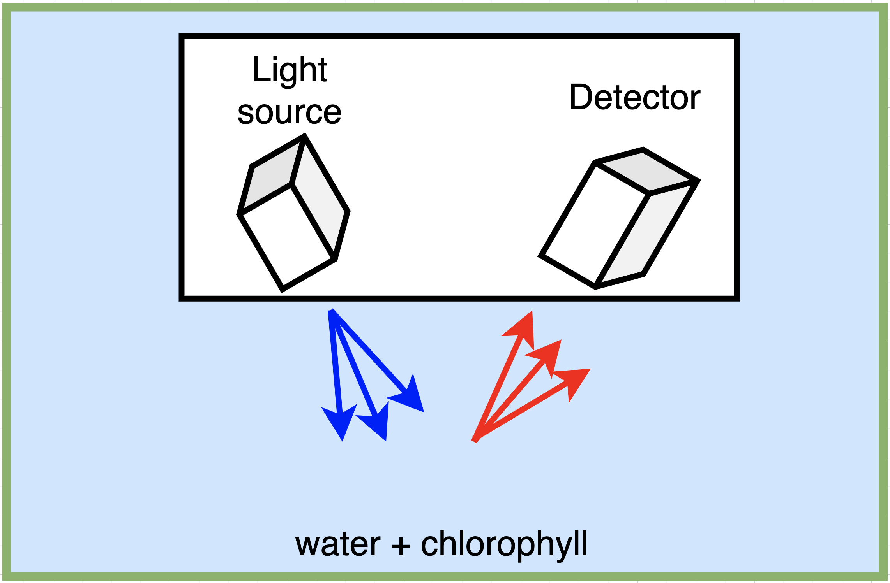
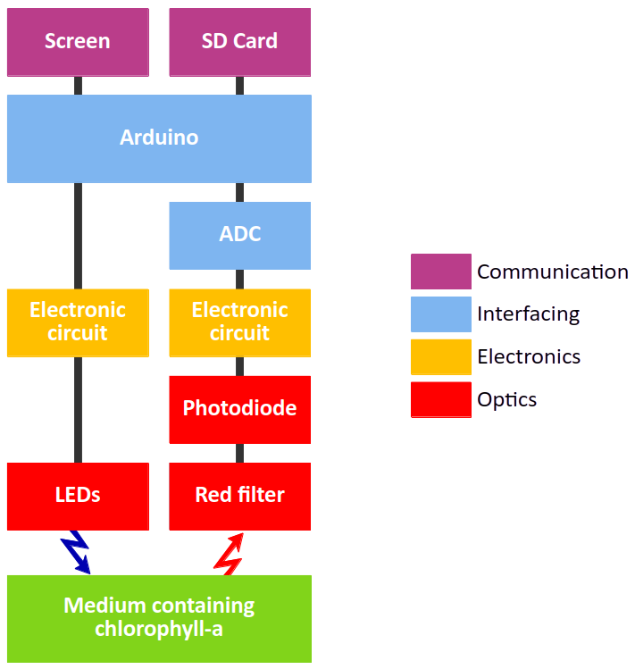

<p align="center">
  
</p>

# Chlorophyll-Fluorometer

## Description

This project aims to develop a portable and low-cost fluorometer for detecting chlorophyll a concentration, a key indicator of phytoplankton presence. The project is conducted by students from ENSSAT in collaboration with the European Institute for Marine Studies (IUEM) and is part of an open-source initiative to facilitate easy and cost-effective replication of the device.

This GitHub repository is intended to provide all necessary resources and instructions to reproduce the product.

## Features

- Measures chlorophyll a concentration in the range of [1-50] µg/L.
- Low-cost (approximately $200), low-tech, and open-source design.
- Portable

## Principle of fluorimetry

<p align="center">
  
</p>

The principle of fluorimetry is based on the fact that chlorophyll a in Phytoplankton, when excited by a blue light source at a wavelength of 430 nm, re-emits light in the red spectrum at 669 nm. In practice, blue light is directed at a sample containing chlorophyll a, causing it to fluoresce red. This red fluorescence is captured by a photodetector, enabling the measurement of chlorophyll a concentration in the sample.

## Functionality

<p align="center">
  
</p>

This setup improves the accuracy of measurements by reducing interference from unwanted light sources. In this fluorimeter, the Arduino board enables modulation and demodulation to eliminate ambient light. A red filter is used to prevent the detection of unwanted light used to stimulate chlorophyll (blue), allowing only the chlorophyll emission wavelength (red) to pass through to the photodiode.

## Components

The main components are:

| Component | Description |
|-----------|-------------|
| LED | Light Emitting Diode for excitation |
| Photodiode | Detects fluorescence |
| Arduino | Microcontroller for processing |
| ADC | Analog to Digital Converter |
| Transistor | LED modulation |
| Amplifier | Enhances signal |
| OLED Screen | Shows values |
| SD Card Shield | Saves values in an SD Card |


For a detailed list of components with the references, please refer to the [Components List](hardware/components.md).

## Construction of the fluorimeter

### Prerequisites

- Arduino IDE
- Electronic components
- 3D printer
- Soldering equipment
- Laser cutter
- ...

### Installation Steps

1. **Clone the Repository:**

   ```bash
   git clone https://github.com/EnssatPhotonicsProjects/Chlorophyll-Fluorometer.git
   ```

### Assemble the Electronic Components

For component assembly, we provide a PCB file and a schematic diagram. It is possible to do everything with a breadboard without PCB.

- **Technical Drawing:** A detailed schematic diagram is provided here: [Circuit-diagram.pdf](hardware/Circuit-diagram.pdf). This diagram includes component placement and connection details.

- **PCB File:** The PCB design file is available in the repository: [PCB](). Use this file to order a PCB from a manufacturer or print it if you have the necessary equipment.

### Assemble Support

- Use the provided STL files to print the necessary support : [LED and photodiode support](hardware/3D_ready_to_print_LED-Photodiode-Support.stl).
- Use the [plans](hardware/Ready_to_laser_cut_Structure-Plans.svg) to cut the PMMA structure with a laser cutter.

### Arduino

- Open the [`.ino`](arduino/main.ino) file in the Arduino IDE and upload it to your Arduino board. The provided code allows displaying the photodiode current in nA.

### Calibration

_It is necessary to have a standard fluorimeter to calibrate our low cost fluorimeter_
- Follow the [calibration protocol](calibration.md) described in the documentation to adjust the fluorometer according to local conditions.

## To contribute

Contributions to this project are welcome. Here's how you can contribute:

1. **Fork the Repository** and create your branch:

   ```bash
   git checkout -b my-new-feature
   ```

2. **Make Your Changes** and test them thoroughly.

3. **Submit a Pull Request** with a detailed description of your changes.

## Avenues for Improvement

## Contributors

Team 2024-2025 :
- Loïc Goumarre (minimadcap)
- Cécile Plaçais (CecileP28)
- Agathe Douissard (Douidoui2)
- Olivier Josephiak (Josephiak)
- Mayssame Ismael
- Hugo Le Moal
- Viken Tevonian
- Merlin Rivière

Team 2023-2024 :
- Jérémy Gigandet
- Brice Hervé
- Thomas Quinchon
- Damien Depauw
- Etienne Chaillot
- Nicolas Chabrier
- Thomas Gysemberg


## Acknowledgments

The authors warmly thank Thierry Chartier, Laurent Bramerie, supervisors of the project at Enssat, Philippe Laborie (Laboratoire de physique corpusculaire, Caen, France) and Etienne Poirier (IUEM, Plouzané, France), members of the steering committee, for their advice and support throughout the project. Special thanks to Etienne Poirier for giving the idea of the project, trusting us and welcome us at IUEM in the last days of the project.

Authors are also very grateful to Antoine Courtay, Hervé Daniel, Clément Dauphin, Hervé Chuberre, teachers at Enssat, and Jean-Philippe Lesault, technician at Enssat, for their advice and technical support. Special thanks to Yvan Guilloit, in charge of the MakerSpace at IUT de Lannion, France, for his help in the integration of the device in the waterproof box.

The fluorometer project started in september 2023 with a first team of Enssat students. Our fluorometer could not have been finalized without their initial work. Many thanks to Nicolas Chabrier, Etienne Chaillot, Damien Depauw, Jérémy Gigandet, Thomas Gysemberg, Brice Hervé, and Thomas Quinchon.

We had the chance to meet Michel Hignette (oceanographer and president of ArmorScience, Lannion, France). We are very grateful to him for sharing his knowledge on phytoplankton.

Hence, we would like to thank to Maël Guibré (student at IUT de Lannion) for the time he took to make some videos of the project.

## License

This project is licensed under [CC BY-SA 4.0]. Please see the [`LICENSE`](LICENSE.md) file for more details.
