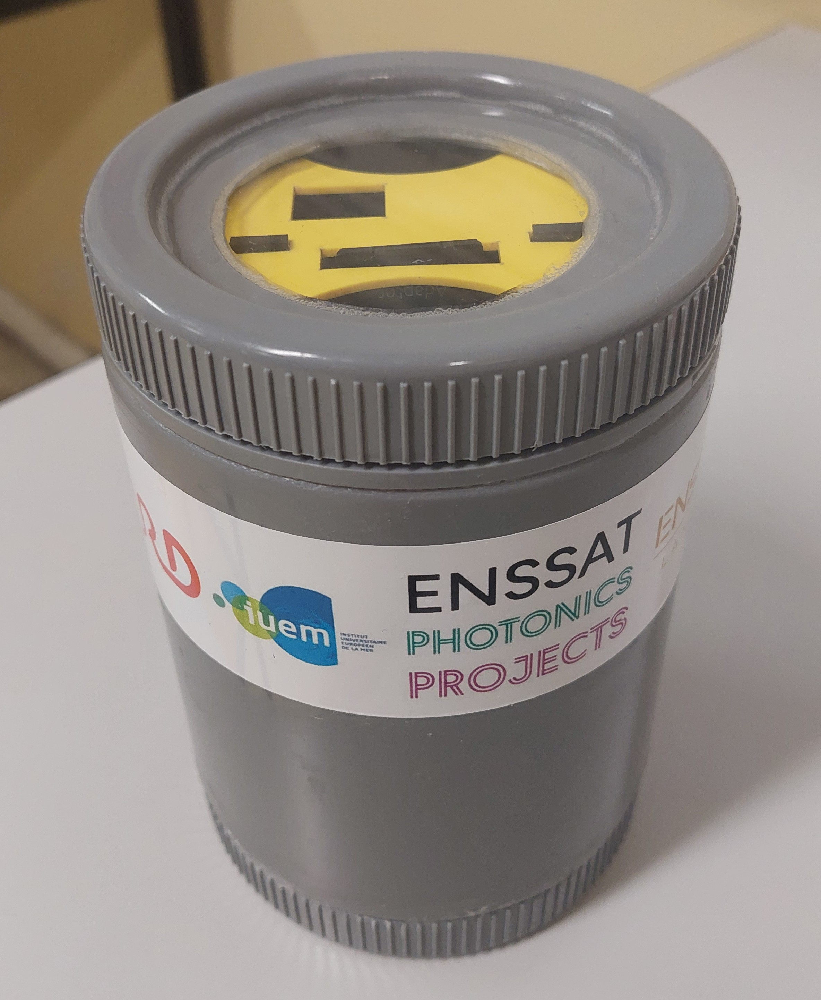

<p align="center">
  
</p>

# Chlorophyll-Fluorometer

## Description

This project aims to develop a portable and low-cost fluorometer for detecting chlorophyll-a concentration, a key indicator of phytoplankton presence. The project is conducted by students in photonics from Enssat in collaboration with the European Institute for Marine Studies (IUEM) and is part of an open-source initiative to facilitate easy and cost-effective replication of the device.

This GitHub repository contains all the necessary resources and instructions for making the device.

The document [Fluoremeter overview] aims to provide an overview of the technical aspects of our fluorometer.

## Features

- Measures chlorophyll-a concentration in the range of [1-50] µg/L.
- Low-cost (approximately $200), low-tech, and open-source design.
- Portable

## Principle of fluorometry

<p align="center">
  
</p>

The principle of fluorometry is based on the fact that chlorophyll-a in phytoplankton, when excited by a blue light source at a wavelength of 430 nm, re-emits light in the red spectrum around 670 nm. This red fluorescence is detected by a photodetector, enabling the measurement of chlorophyll-a concentration in the sample.

## Functionality

<p align="center">
  
</p>

With our setup, high sensitivity is achieved by usind two LEDs and a large-area photodiode to collect more efficiently fluorescence. A red filter is used to prevent the detection of wavelengths other than red. The Arduino board enables modulation and demodulation to eliminate ambient red light.

## Components

The main components are:

| Component | Description |
|-----------|-------------|
| LED | Light Emitting Diode for blue excitation |
| Photodiode | Detects red fluorescence |
| Arduino | Microcontroller for processing |
| ADC | Analog to Digital Converter |
| Transistor | For LED power supply |
| Amplifier | For signal enhancement|
| OLED Screen | Displays values |
| SD Card Shield | Saves values in an SD Card |


For a detailed list of components with the references, please refer to the [Components List](hardware/components.md).

## Construction of the fluorometer

### Prerequisites

- Arduino IDE
- Electronic components
- 3D printer
- Soldering equipment
- Laser cutter

### Installation Steps

1. **Clone the Repository:**

   ```bash
   git clone https://github.com/EnssatPhotonicsProjects/Chlorophyll-Fluorometer.git
   ```

### Assembling the fluorometer

Follow the steps of the [assembly guide](assembly_guide.md) to build the fluorometer.

<p align="center">
  
</p>

## Avenues for Improvement

- The photodiode becomes saturated when used outdoors in bright light.
- The PVC box may not withstand high pressure underwater.

Contributions are welcomed to improve these points.

## To contribute

Contributions to this project are welcome. Here's how you can contribute:

1. **Fork the Repository** and create your branch:

   ```bash
   git checkout -b my-new-feature
   ```

2. **Make Your Changes** and test them thoroughly.

3. **Submit a Pull Request** with a detailed description of your changes.

## Contributors

Team 2024-2025 :
- Loïc Goumarre (minimadcap)
- Cécile Plaçais (CecileP28)
- Agathe Douissard (Douidoui2)
- Olivier Josephiak (Josephiak)
- Mayssame Ismael (Goulgoul1)
- Hugo Le Moal
- Viken Tevonian
- Merlin Rivière

Team 2023-2024 :
- Jérémy Gigandet
- Brice Hervé
- Thomas Quinchon
- Damien Depauw
- Etienne Chaillot
- Nicolas Chabrier
- Thomas Gysemberg


## Acknowledgments

The authors warmly thank Thierry Chartier, Laurent Bramerie, supervisors of the project at Enssat, Philippe Laborie (Laboratoire de physique corpusculaire, Caen, France) and Etienne Poirier (IUEM, Plouzané, France), members of the steering committee, for their advice and support throughout the project. Special thanks to Etienne Poirier for giving the idea of the project, trusting us and welcome us at IUEM in the last days of the project.

Authors are also very grateful to Antoine Courtay, Hervé Daniel, Clément Dauphin, Hervé Chuberre, teachers at Enssat, and Jean-Philippe Lesault, technician at Enssat, for their advice and technical support. Special thanks to Yvan Guilloit, in charge of the MakerSpace at IUT de Lannion, France, for his help in the integration of the device in the waterproof box.

The fluorometer project started in september 2023 with a first team of Enssat students. Our fluorometer could not have been finalized without their initial work. Many thanks to Nicolas Chabrier, Etienne Chaillot, Damien Depauw, Jérémy Gigandet, Thomas Gysemberg, Brice Hervé, and Thomas Quinchon.

We had the chance to meet Michel Hignette (oceanographer and president of ArmorScience, Lannion, France). We are very grateful to him for sharing his knowledge on phytoplankton.

Hence, we would like to thank Maël Guibré (student at IUT de Lannion) for the time he took to make some videos of the project.

## License

This project is licensed under [CC BY-SA 4.0]. Please see the [`LICENSE`](LICENSE.md) file for more details.
