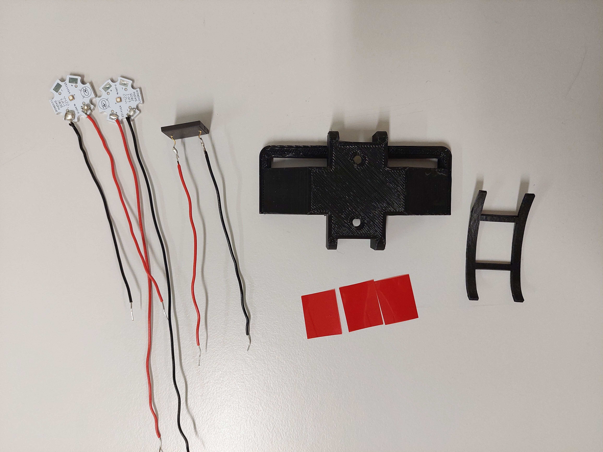
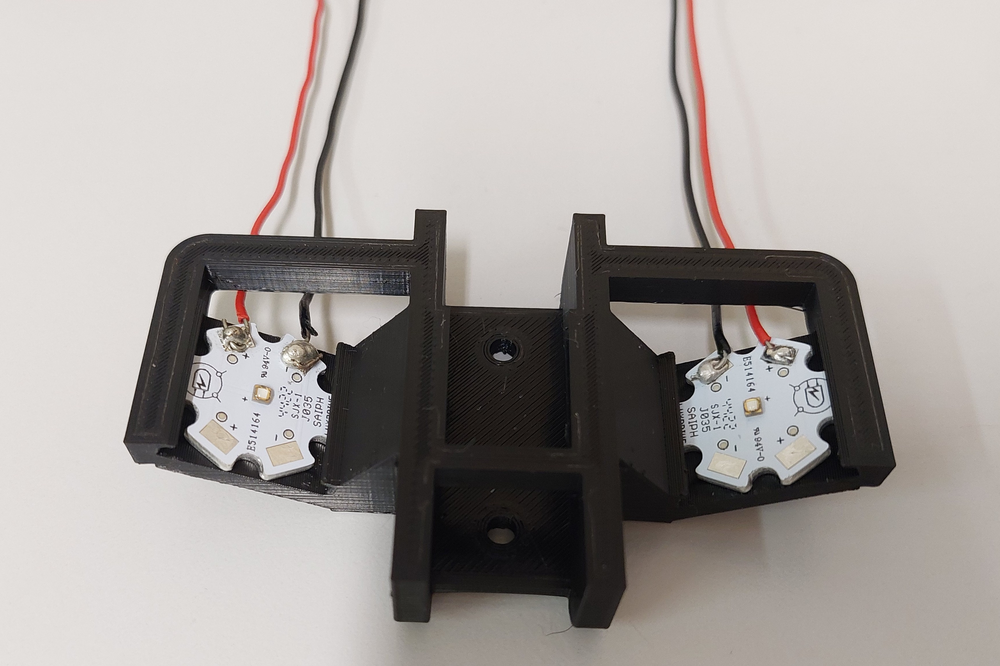
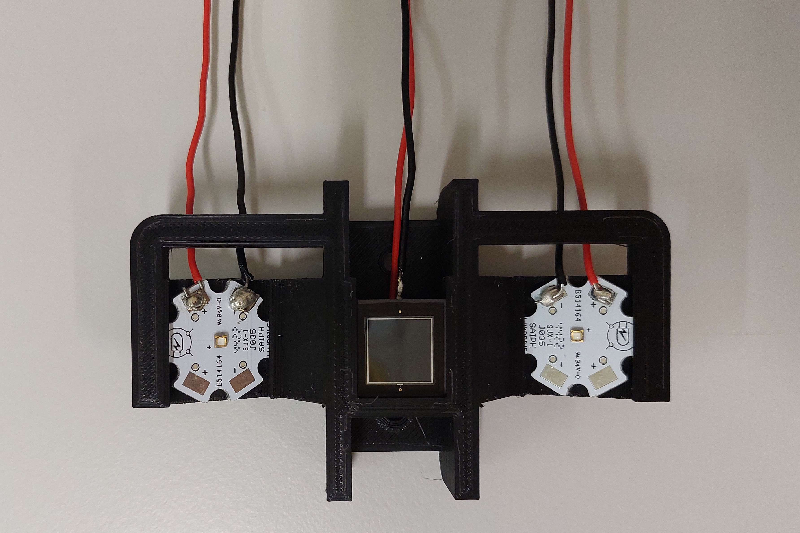
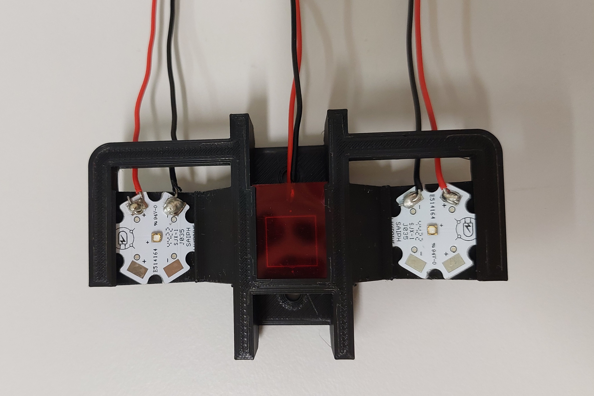
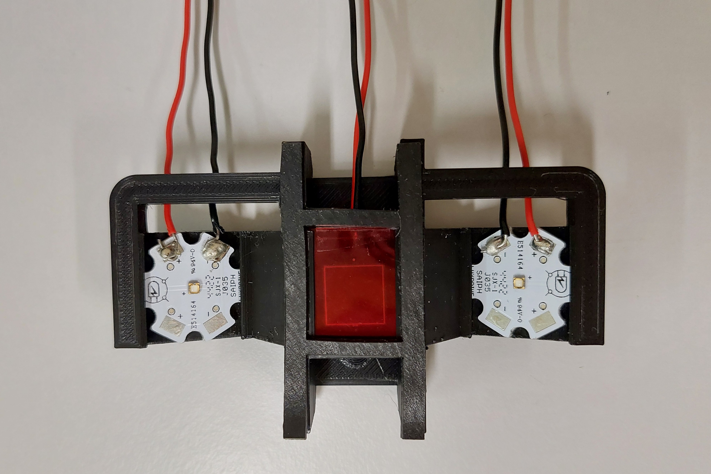
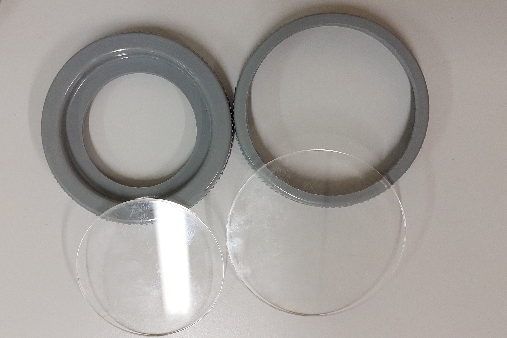
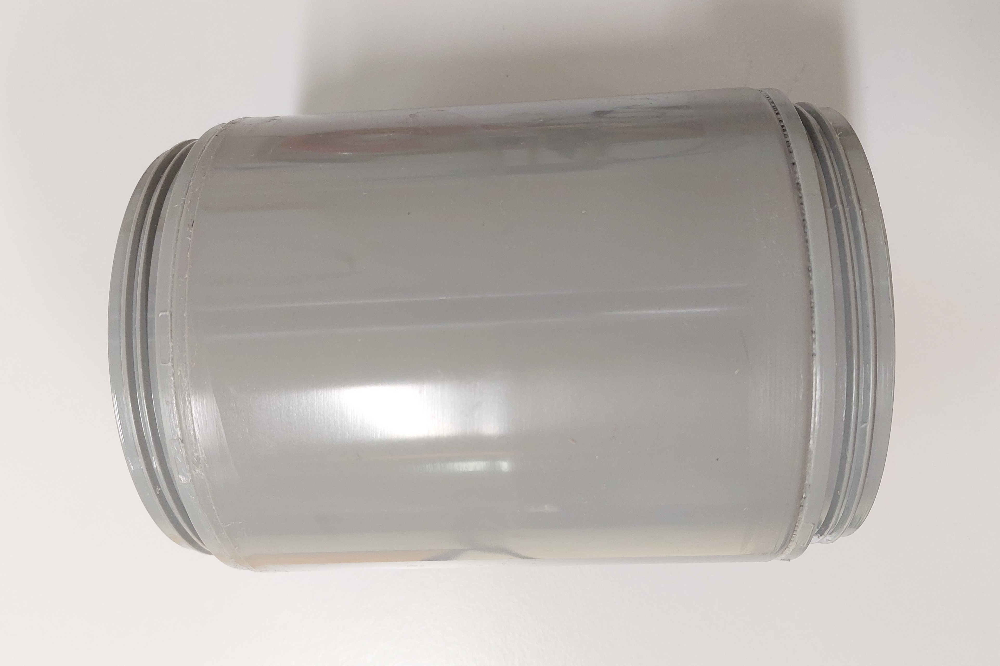

# Assembly Guide for Support Structures

This guide provides detailed instructions on how to assemble the Chlorophyll-Fluorometer structures.

## Prerequisites

Before starting the assembly process, ensure you have the following tools and components ready:

- Components from the [Components List](hardware/components.md)
- PVC glue
- Sandpaper
- PVC stripper
- Laser cutter
- Screws, nuts, washers
- Paper towel or rag
- Wires (red and black)
- Soldering station

## Step 1 : Assemble the LEDs and photodiode support

Start by soldering wires to the LEDs and photodiode terminal. Pay attention to the polarity of the terminals : you can solder a red wire on the + terminals of the LED and the cathode terminal of the photodiode. A black wire can be soldered on the - terminals of the LEDs and on the anode of the photodiode.

When this is done, you can assemble de following components :
- Two LEDs
- Photodiode
- (Red filter : 16 x 20 mm) X3
- 3D printed support
- Seal

  

1. Position the LEDs in their slots. If they don't fit, you can lightly file the LEDs bases. The LEDs must be perfectly held by the support and must not move. The wires must come out of the back of the bracket.

  

2. Position the photodiode in its slot. Bend the wires to make them come out of the back of the bracket.

  

3. Add the three pieces of red filter. You can slide them in the photodiode slot, this will hold everything in place in the holder. However, make sure that the filters are perfectly flat on the photodiode, or light could pass underneath. You can add a small piece of scotch tape to the end of the filters and fold it over the photodiode so that nothing escapes.

  

4. Glue the seal under the support.

  

## Step 2 : Assemble the internal structure

The materials required for this step are :
- The Arduino UNO R3 board
- The PCB board with all the electronic components (Screen, SD Card shield)
- 4 spacers of 5 mm
- 4 screws, diameter 3 mm, length 5 mm + nuts
- 16 spacers of 30 mm
- 4 countersunk screw, diameter 3 mm, length 8 mm + nuts + washers
- 2 screws, diameter 3 mm, length 10 mm + nuts + washers
- 2 screws, diameter 2 mm, length 12 mm + nuts + washers
- a powerbank (100 x 50 x 2.5) mm max
- a dual output power supply and angled USB output cable
- The LEDs and photodiode support made in the previous step
- black PMMA sheet, thickness 3 mm
- transparent PMMA sheet, thickness 3 mm
- Screwdriver
- Laser cutter

Photo
1. Cut the structure in the PMMA sheets with the laser cutter. In transparent PMMA, cut the [top plate](...). In black PMMA, cut the [face and bottom plates](...).

Photo

2. Screw 3 screws and 5 mm spacers to the Arduino board, as shown in the photo below. Connect the PCB to the Arduino board.

Photo

3. Take the face plate. Locate the side where the Arduino board goes. On the opposite side, screw the SD Card shield. Put a washer between the shield and the plate. The screws must protrude from the side of the module. You can loosen the nuts slightly, the height of the module will then be adjusted. Add a screw and a 5 mm spacer in the hole at the bottom left of the module.

Photo

4. Screw the Arduino board on the opposite face of the plate.

Photo

5. Take the bottom plate and the LEDs and photodiode support. Screw the LEDs and photodiode support under the bottom plate. Make sure that the large hole in the plate is on the same side as the wires. You can loosen the nuts for now, the position of the support will be adjusted. Pass the wires through the hole.

Photo

6. Take a plug. Adjust the position of the support. It should be in the center of the plug, and so should the plate. When the positions are correct, tighten the screws.

Photo

7. Screw the spacers into the four corners.

Photo

8. Screw the LEDs and photodiode wires into terminal strips of the PCB.

Photo

9. Put the face plate in the bottom plate, bend the wires of the LEDs and photodiode. Make sure they didn't move in the process.

Photo

10. Screw the top plate. You can now adjust the position of the SD card shield so that it can be removed easily, but without protruding too far. Tighten the screws when the position is good.

Photo

11. Put the powerbank and the alimentation cable.

## Step 3 : Assemble the waterproof box

In this step, you will need :
- PVC sleeve
- Two PVC inspection plugs
- PMMA plastic plate
- PVC glue
- Sandpaper
- PVC stripper
- Laser cutter
- Paper towel or rag
- Ø89 and Ø84 hole saws
- Angle grinder

  

1.  Cut out the inside of the plugs, one with the Ø89 hole saw, and the other with the Ø84 hole saw. Make sure the holes are at the center of the plugs. Using a laser cutter, cut two PMMA discs, one 96.5 mm in diameter, the other 82.5 mm in diameter. The disc of 82.5 mm diameter needs to be sanded to fit perfectly in the plug. Using an angle grinder, sand one edge of the disc.

  

2.  Glue the PMMA discs to the plugs : the smallest disc goes into the plug with the smallest hole, on the outside. The largest disc goes into the plug with the largest hole, on the inside of the plug. To glue, start by sanding the surfaces to be glued, then clean them with paint stripper. Apply a generous amount of glue to each surface, and press the pieces together firmly. Leave to dry for at least an hour. Then you can test the watertightness of the adhesive by placing the plugs on the surface of the water. If they float and there is no seepage, the bond is correct.

Photos

3. Glue the rings for screwing on plugs to the sleeve. As above, sand the surfaces to be glued, then clean them. Apply a generous amount of glue. Leave to dry for at least an hour. You can test for leaks on either side by screwing on the plug with the smallest window and dipping the sleeve halfway into the water. If there is no infiltration, the bond is correct.

  

4. Glue the plug with the largest window to one side of the sleeve. Apply a generous amount of glue to the threads of the sleeve and plug. Also apply glue to the gap between the sleeve and the plug, on the outside of the sleeve and on the indside, between the PMMA disc and the sleeve. Leave to dry for several hours. Test for leaks by immersing the sleeve halfway in water. If there are any leaks, add glue to the inside and/or outside of the sleeve where the leaks are. Allow to dry again and try again. You may need to repeat the operation several times until the seal is perfect.

Photo

The box is waterproof. The glued plug is the bottom, where LEDs and photodiode are located. The removable plug is on the top. Make sure that the seal is still present in the top cap when you close it, overwhise it may not be waterproof.

## Step 4 : Assemble the fluorometer

Slide the internal structure into the box. It must be at the bottom and must not move. Switch on the battery, and close the box.
